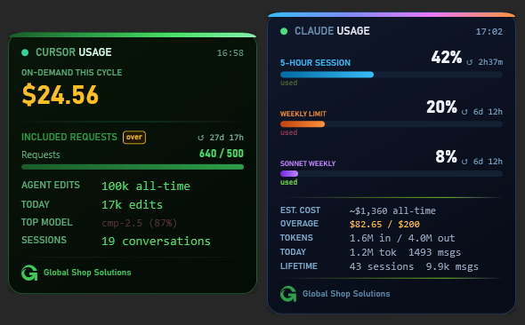

# AI Usage Overlay

Always-on-top Windows HUD that shows live usage stats for Claude Code, Codex, and Cursor IDE in one unified panel.



## What It Shows

**Claude Code**
- 5-hour session %, weekly limit %, Fable %, overage spend, lifetime tokens

**Codex**
- Local session tokens, estimated API-equivalent value, sessions, and today's activity

**Cursor IDE**
- On-demand spend (hero), included requests with OVER detection, agent edits, top model, sessions

## Install

**One-liner** — paste this into PowerShell, or hand it to your Claude / Cursor agent:

```powershell
irm https://raw.githubusercontent.com/tjones-gss/ai-usage-overlays/master/install.ps1 | iex
```

That's it. No git, no Python, no admin rights. Downloads, installs, and launches the unified overlay automatically.

**Let your AI agent do it** — paste this into Claude Code or Cursor chat:
> Run this in PowerShell to install the AI usage overlay: `irm https://raw.githubusercontent.com/tjones-gss/ai-usage-overlays/master/install.ps1 | iex`

**Manual install** — clone the repo and run `Install.bat`. Login autostart uses `Start-Unified.vbs`.

## Requirements

- Windows 10/11
- PowerShell 7 (`pwsh`)
- Claude Code CLI signed in (`claude auth login`)
- Codex sessions under `~\.codex\sessions`
- Cursor IDE signed in

## Usage

| Action | How |
|---|---|
| Show / hide overlay | Left-click the **AI** tray icon |
| Show / hide Claude, Codex, or Cursor section | Right-click -> section toggle |
| Expand / collapse a section | Click its section header |
| Options, themes, opacity | Right-click the overlay |
| Quit | Right-click → Quit |

The overlay saves its position, opacity, theme, and expanded sections.

## Uninstall

```bat
Uninstall.bat
```

## Features

- **Always on top** — stays visible over all other windows
- **Unified sections** — Claude Code, Codex, and Cursor in one process and one tray icon
- **Color themes** — Global Shop, Deep Space, Ocean, Mono, and Black & White (right-click → Theme)
- **Drag to reposition** — position saved between restarts
- **Opacity control** — right-click → Opacity
- **Snap to corners** — right-click → Snap to corner
- **GSS branding** — Global Shop Solutions identity in the footer

## How It Works

The overlay is a PowerShell 7/WPF app that reads auth tokens and local usage data from your existing Claude, Codex, and Cursor sessions. No credentials are stored separately, no elevated permissions are required, and Cursor local stats are read with the bundled `sqlite3.exe`.
